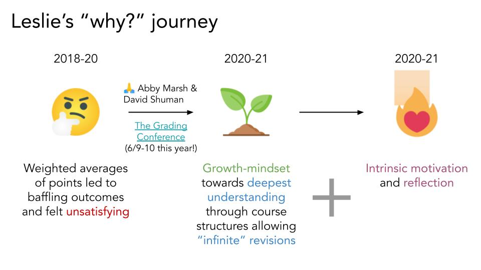

[Slides](https://docs.google.com/presentation/d/1G72nKlVExBfKWy71x005bHD0FqeYlQbWzob6kWwqJyA/edit?usp=share_link)

(Joint seminar with Ahoo Najafian)

Center for Scholarship and Teaching seminar • Macalester College • April 7, 2023

**Abstract:** At its heart, alternative grading is a quest to make learning beautiful and lasting. In this talk, I’ll share strategies attempted, lessons learned, and hopes remaining based on my engagement with the alternative grading community over the last few years.

