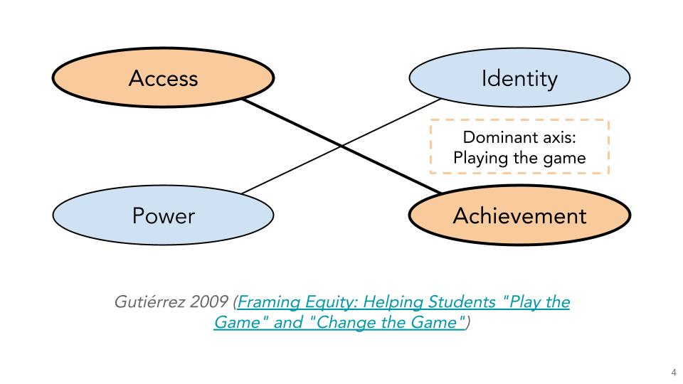

[Slides](https://docs.google.com/presentation/d/1CyYLhzxDRJKXg7VmAXbBUCeFBtCES180zCOorbG-7CY/edit?usp=sharing)

[ASA Joint Statistical Meetings 2023](https://ww2.amstat.org/meetings/jsm/2023/) • Washington, D.C. • August 9, 2023

**Abstract:** In the spirit of Gutiérrez (2009), access represents all of the opportunities available for student learning. Cultivating access is essential for critically examining student achievement, identity, and power. In this talk, I will discuss my approach to creating access to learning opportunities in a systematic way: through resources and practices. Resources include both content and human resources. Practices are habits that both students and instructors can enact to more fully access those content and human resources. High-impact resources and practices have the potential to change the game for both students and instructors.

